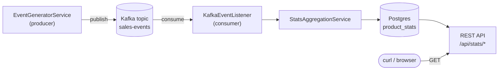

# retail-analytics-pipeline

[](https://github.com/reda-ous/retail-analytics-pipeline/actions/workflows/ci.yml)

A real-time retail sales event pipeline: a producer generates fake sales events, publishes them to Kafka, and a consumer aggregates them into Postgres and exposes the results over a REST API.

Built to demonstrate Java 21 in a real event-driven Spring Boot system, not a toy example — real Kafka, real Postgres, and an integration test that runs against actual containers instead of mocks.

## What it does

- **Producer**: every 2 seconds, fabricates one of three sales events (`OrderCreated`, `StockUpdated`, `PriceChanged`) for a small fake product catalog and publishes it to a `sales-events` Kafka topic.
- **Consumer**: listens to that topic, aggregates events into a `product_stats` table in Postgres (orders, quantity sold, revenue, current stock, current price per product), and serves the aggregated stats over `/api/stats`.



## Quick start

Requires Docker (or Podman with Docker CLI compatibility).

```bash
git clone https://github.com/reda-ous/retail-analytics-pipeline.git
cd retail-analytics-pipeline
docker-compose up -d --build
```

That launches all four services — Kafka, Postgres, producer, consumer — with one command. Give it a few seconds, then:

```bash
curl http://localhost:8080/api/stats/summary
curl http://localhost:8080/api/stats/products
```

A ready-to-run [`requests.http`](requests.http) file is included for the [REST Client](https://marketplace.visualstudio.com/items?itemName=humao.rest-client) VS Code extension if you'd rather click than curl.

## Why these choices

**Kafka, not a simple queue.** A plain queue loses a message once it's consumed. Here, the same event log could feed the stats consumer *and* a future fraud-detection consumer *and* a future recommendation consumer, each independently, each able to replay history from its own offset. Partitioning by `productId` also guarantees per-product event ordering (all events for one product land on the same partition) while still processing different products concurrently.

**Virtual threads for consumption.** Each Kafka partition's listener does blocking I/O against Postgres. `spring.threads.virtual.enabled=true` puts each partition's listener on its own virtual thread (JEP 444) instead of a dedicated platform thread, so a slow write on one partition never blocks the others — verified by logging `Thread.currentThread()` in [`KafkaEventListener`](consumer/src/main/java/com/retailpipeline/consumer/service/KafkaEventListener.java), which prints `VirtualThread[...]` at runtime.

**No Lombok.** The whole point of this project is showing off *native* Java 21 features — records, sealed interfaces, pattern matching — so generating boilerplate through annotation processing would sit oddly next to that. JPA entities use plain getters/setters instead.

## Java 21 features, and where to find them

| Feature | Where | Why |
|---|---|---|
| Records | [`common/.../event/`](common/src/main/java/com/retailpipeline/common/event) | `OrderCreated`, `StockUpdated`, `PriceChanged` — immutable event data with generated accessors, `equals`, `hashCode`, `toString` |
| Sealed interfaces | [`SalesEvent.java`](common/src/main/java/com/retailpipeline/common/event/SalesEvent.java) | `sealed interface SalesEvent permits OrderCreated, StockUpdated, PriceChanged` — the compiler knows these are the *only* possible event types |
| Pattern matching for switch | [`StatsAggregationService.java`](consumer/src/main/java/com/retailpipeline/consumer/service/StatsAggregationService.java) | Exhaustive `switch` over the sealed hierarchy — routing logic that fails to compile if a new event type isn't handled |
| Virtual threads | [`KafkaEventListener.java`](consumer/src/main/java/com/retailpipeline/consumer/service/KafkaEventListener.java) | Concurrent, per-partition Kafka consumption without dedicating an OS thread per partition |

## Testing

```bash
cd consumer
mvn test
```

[`SalesEventPipelineIntegrationTest`](consumer/src/test/java/com/retailpipeline/consumer/SalesEventPipelineIntegrationTest.java) spins up a real Kafka broker and a real Postgres instance via [Testcontainers](https://testcontainers.com/), publishes a raw event straight to Kafka (standing in for the producer), and polls the REST API until the consumer has aggregated it — no component in this test is mocked. Requires Docker running locally.

## Project structure

Multi-module Maven build:

```
common/     shared event model (records + sealed interface), no framework dependencies beyond Jackson
producer/   Spring Boot app — generates and publishes fake sales events
consumer/   Spring Boot app — Kafka listener, JPA aggregation, REST API
```

## Local development (without Docker Compose)

Handy for IDE debugging. Start just the infrastructure, then run `producer`/`consumer` from your IDE or `mvn spring-boot:run` — both default to `localhost` when the relevant env vars aren't set, so no config changes are needed either way.

```bash
docker-compose up -d kafka postgres
```

## What's next

- A small Vue3 dashboard for live stats (optional — the backend/Kafka side is the point of this project)
